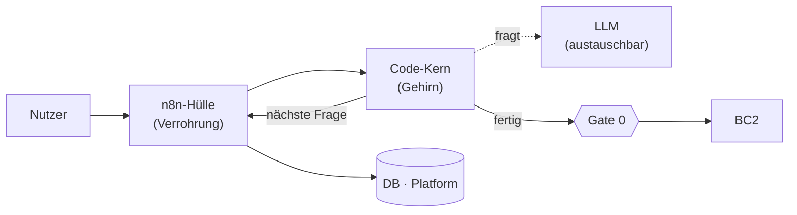

# BC1 — Systemarchitektur (technische Ebene)

> **Team:** Richard, Philipp · **Stand:** 2026-06-23
> Diese Datei beschreibt die **technische Ebene** von BC1 (*wie* gebaut wird) und ergänzt die bestehende **Konzept-Ebene** (*was* die Teile sind). **Generisch** — konkrete Use Cases werden separat als „Use-Case-Pakete" eingehängt, ohne den Kern zu ändern.

## Big Picture

BC1 verwandelt unstrukturierte Eingaben (im MVP: Text-Chat) in ein strukturiertes **Prozessprofil (JSON)** mit Vollständigkeits-Status und übergibt es am **Gate 0** an BC2.

Bauweise = **Hybrid**:
- **n8n = Hülle / Verrohrung:** Chat rein/raus, Persistenz, Transport. Bewusst „dumm".
- **Code-Kern = Gehirn:** Dialog, Extraktion, Vollständigkeitsprüfung. Testbarer Code.

Eine Schnittstelle n8n → Kern: `{session_id, message_id, message}` → `{status, payload}` mit `status ∈ frage | fertig | fehler_fortsetzbar`.

## Kern-Module (je eine Verantwortung)

| Modul | Aufgabe | LLM? |
|---|---|---|
| **State-Store** | Session-Zustand (gefüllte Felder + Status), besitzt Persistenz & Versionierung | nein |
| **Use-Case-Paket** | deklarativ: Zielfelder, Validatoren, Abschlussregeln, Frage-Leitfaden (die austauschbare Stelle) | nein |
| **Extractor** | Nachricht → Feld-Kandidaten, jeder mit Quelle | ja |
| **Confidence-Check** | reine Logik: Status je Pflichtfeld + Vollständigkeit (gezählt, nicht geschätzt) | nein |
| **Dialog-Manager** | Priorisierung, Nachfrage-Limits, Fragenauswahl, „fertig?" | ja (nur Formulierung) |
| **LLM-Client** | Adapter, versteckt den Anbieter; austauschbar | — |
| **Orchestrator** (`process_turn`) | verbindet alles zur einen Schnittstelle | nein |

## Datenfluss (eine Runde)

1. n8n ruft den Kern mit `{session_id, message_id, message}`.
2. **Rohnachricht zuerst sichern** (vor jedem LLM-Aufruf).
3. **Idempotenz-Check** über `message_id`.
4. State laden (atomar, versioniert) → **Extractor** → **Merge** (Konflikte markieren, nicht überschreiben) → **Confidence-Check** → **Dialog-Manager**.
5. State speichern; Antwort zurück: nächste Frage (Schleife) **oder** Profil + Vollständigkeit an Gate 0.

## Leitprinzipien

- Persistenz **im Kern** (atomar, versioniert); n8n schreibt nie den Zustand.
- **Keine erfundenen Zahlen** — erklärbare Status (`fehlt/gueltig/ungueltig/unklar/ungeloest`) + gezählte Vollständigkeit.
- Output trägt immer **Vollständigkeit + ungelöste Felder + `schema_version`**.
- Nie still scheitern; Mensch an Gate 0 ist das Sicherheitsnetz.
- **Generisch bis Use Cases** — danach Use-Case-Paket einhängen (lokaler Schritt).

## MVP-Scope & Abgrenzung

- **MVP-Kern:** Text-Interview → JSON (Module oben).
- **Spätere Schichten** (eigenständig andockbar): Voice/OCR ([#49](https://github.com/pg-coe-kmu/coe-factory/issues/49)) · PII-Filter ([#50](https://github.com/pg-coe-kmu/coe-factory/issues/50)) · Doku-Generator ([#52](https://github.com/pg-coe-kmu/coe-factory/issues/52)) · Baseline-Mapper ([#53](https://github.com/pg-coe-kmu/coe-factory/issues/53)).
- **Nicht BC1:** DB/Infra/Audit/Verschlüsselung → Platform · Konzept-Übersicht → bestehende Team-Ebene.
