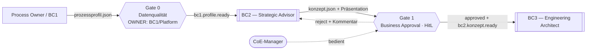
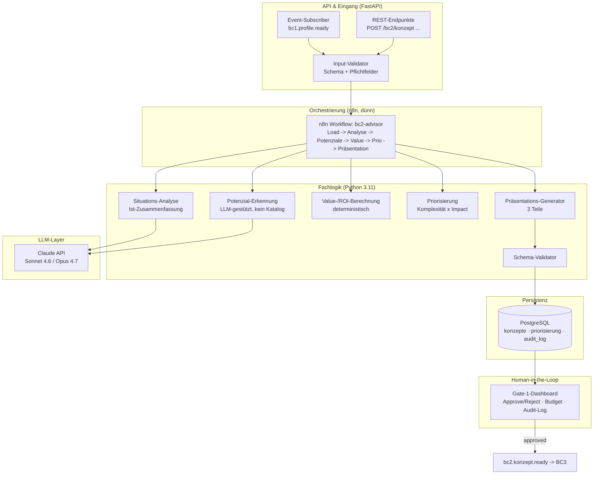
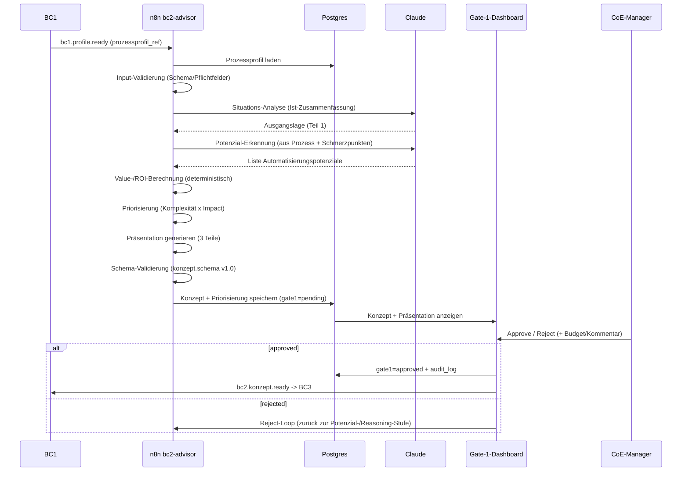
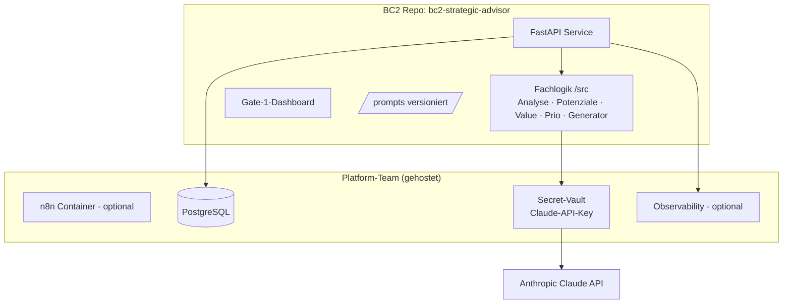

# BC2 — Strategic Advisor · Systemarchitektur (v2)

**Projekt:** Autonomous CoE Factory · PG KI-CoE-KMU (SS 2026)
**Bounded Context:** BC2 — Strategic Advisor (zwischen Gate 0 und Gate 1)
**Verantwortlich:** Sergio Morazán Irias (allein, seit 30.08.2026)
**Verträge:** `contracts/bc2-to-bc3/konzept.schema.json` v2.0 · `priorisierung.schema.json` v2.0
**Stand des Dokuments:** 27.06.2026 — **teilweise überholt, siehe Warnkasten**

> [!WARNING]
> **Dieses Dokument ist Stand 27.06.2026 und in Teilen überholt.** Maßgeblich sind die
> Datenbank (Messung an [#159](https://github.com/pg-coe-kmu/coe-factory/issues/159)) und die
> Karte [#158](https://github.com/pg-coe-kmu/coe-factory/issues/158). Konkret gilt hier **nicht** mehr:
>
> | Im Dokument | Tatsächlich |
> |---|---|
> | Stack-Zeile „n8n · … · Redis · Qdrant" und die n8n-Pipeline in §2/§3 | **Kein n8n, kein Qdrant, kein Redis.** Reines Python (FastAPI + Claude direkt), Agenten selbst gebaut. §5 sagt das bereits: „für MVP genügt zunächst plain Python". |
> | „Verträge v1.0", `use_cases[]`, `empfohlenes_muster` | **v2.0**, `potenziale[]`, offen erkannt |
> | Eingang „prozessprofil.json aus BC1" | **Gemeinsame PostgreSQL**, direkt gelesen; BC1s Schema ist leer |
> | Team Eike + Sergio, Sprints S1–S6, KW 20–31, Meilensteine M1–M4 | **Sergio allein**; alle Zeitpläne der Altdokumente sind ungültig |
>
> Gültig geblieben ist §0 (was BC2 produziert: Ausgangslage · Potenziale · Kostenschätzung)
> samt der Absage an den festen Musterkatalog. Die inhaltliche Neufassung hängt am
> Domänenmodell ([#164](https://github.com/pg-coe-kmu/coe-factory/issues/164)) und am
> Frontend-Schnitt ([#167](https://github.com/pg-coe-kmu/coe-factory/issues/167)).

---

## 0. Was BC2 produziert (Zielbild) ⭐

BC2 nimmt das **Prozessprofil aus BC1** (Ist-Situation) und erzeugt daraus eine **entscheidungsreife Präsentation** im Stil eines KI-/Automatisierungs-Workshops. Diese Präsentation ist der zentrale, vorzeigbare Output (L2-05) und besteht aus drei Teilen:

| Teil | Inhalt | Quelle in der Pipeline |
|---|---|---|
| **1 · Ausgangslage** | Zusammenfassung der aktuellen Situation (Unternehmen, Systeme, Prozesse, Herausforderungen) | Situations-Analyse aus BC1-Profil |
| **2 · Automatisierungspotenziale** | Erkannte Potenziale je mit Beschreibung, **Impact**, Aufwand-heute, Komplexität, Priorisierung (Komplexität × Impact) | Potenzial-Erkennung + Value-Berechnung |
| **3 · Kostenschätzung** | Investitionsrahmen je Potenzial (Richtwert) + erwarteter Nutzen / Amortisation | Value-/ROI-Berechnung |

> **Wichtig — kein fester Musterkatalog:** BC2 ordnet **nicht** vorgegebene Automatisierungsmuster zu, sondern **erkennt Potenziale** aus dem konkreten Prozess und **berechnet deren möglichen Value**. (Das ersetzt die ursprüngliche „Pattern-Matching-Engine + Qdrant".)

Parallel zur Präsentation liefert BC2 die **maschinenlesbaren Verträge** (`konzept.schema.json`) an BC3, damit BC3 daraus Tickets ableiten kann.

---

## 1. Einordnung im Gesamtsystem (Context View)

BC2 ist ein eigenständiger Bounded Context. Es konsumiert **ausschließlich** das BC1-Vertrags-Artefakt (Schema), nicht den BC1-Code.



**Gate 0 gehört zu BC1/Platform (korrigiert):** Der Produzent (BC1) garantiert die Vertragsqualität und feuert `bc1.profile.ready` nur, wenn die Qualität stimmt. BC2 macht an seiner Grenze nur eine **schlanke, defensive Eingangsvalidierung** (Schema + Pflichtfelder) — kein eigenes schweres Gate 0.

---

## 2. Komponentenarchitektur (innerhalb BC2)



**Verantwortlichkeiten je Komponente**

| Komponente | Aufgabe |
|---|---|
| Input-Validator | Defensive Prüfung: ist das BC1-JSON schema-konform, sind Pflichtfelder da? (kein schweres Gate 0) |
| Situations-Analyse | Fasst die Ist-Situation aus dem Prozessprofil zusammen → **Teil 1** der Präsentation |
| **Potenzial-Erkennung** | Erkennt aus Prozessschritten/Schmerzpunkten **Automatisierungspotenziale** (LLM-gestützt, **kein** fester Katalog) → **Teil 2** |
| **Value-/ROI-Berechnung** | Rechnet je Potenzial: Aufwand-heute, Einsparung €/Jahr, Impact, Komplexität, Investition, Amortisation → **Teil 2 + 3** |
| Priorisierung | Sortiert Potenziale nach Komplexität × Impact (Quick Wins zuerst) |
| Präsentations-Generator | Baut die 3-teilige Präsentation (Ausgangslage · Potenziale+Impact · Kosten) |
| Schema-Validator | Validiert `konzept.json` gegen `konzept.schema.json` v1.0 (für BC3) |
| Gate-1-Dashboard | HitL Approve/Reject, Audit-Log, Reject-Loop |

---

## 3. Laufzeit-Pipeline (n8n `bc2-advisor`)



---

## 4. API-Design (FastAPI)

**Was ist FastAPI?** Ein modernes Python-Web-Framework zum schnellen Bauen von **REST-APIs**. Man schreibt eine Funktion mit Typ-Hints, FastAPI erzeugt daraus den HTTP-Endpunkt **und** automatisch die OpenAPI-/Swagger-Doku (unter `/docs`). Es ist also schlicht die Technik, mit der die untenstehenden Endpunkte bereitgestellt werden — leichtgewichtig, async-fähig, weit verbreitet.

| Methode | Pfad | Zweck |
|---|---|---|
| `POST` | `/bc2/konzept` | Konzept-Erzeugung anstoßen (Body `{prozessprofil_ref}`) → startet Pipeline, gibt `konzept_id` |
| `GET` | `/bc2/konzept/{id}` | Ein Konzept abrufen (Dashboard & BC3) |
| `GET` | `/bc2/konzepte?status=pending` | Liste (z. B. offene fürs Gate 1) |
| `GET` | `/bc2/konzept/{id}/praesentation` | Präsentation (3 Teile) abrufen — JSON / Markdown / PDF |
| `GET` | `/bc2/priorisierung/{id}` | Priorisierung (L2-02) |
| `POST` | `/bc2/konzept/{id}/gate1` | Gate-1-Entscheidung (Body `{status, kommentar, budget}`) → feuert `bc2.konzept.ready` |
| `GET` | `/healthz` · `/readyz` | Health-Checks |
| `POST` | `/bc2/potenziale` *(intern/Debug)* | Nur Potenzial-Erkennung testen |

---

## 5. Frontend / Human-in-the-Loop

| Gate | Frontend? | Begründung |
|---|---|---|
| **Gate 0** (Datenqualität) | **Nein** | Automatischer Schwellwert-Check (Vollständigkeit, PII). Keine menschliche Entscheidung → kein UI. Liegt bei BC1/Platform. |
| **Gate 1** (Business Approval) | **JA** | Das **Gate-1-Dashboard** ist BC2s einziges echtes Frontend: Web-UI für den CoE-Manager — Potenziale, Impact, ROI, **Approve/Reject**, Budget, Audit-Log. |

---

## 6. MVP vs. Ziel-Architektur (warum welche Komponente?)

Ihr seid ein 2-Personen-Team und baut bis M2 ein **Walking Skeleton**. Vieles ist „Ziel-Bild" und für den MVP **optional**.

| Komponente | Wofür | MVP-Pflicht? | Erklärung |
|---|---|---|---|
| **FastAPI** | REST-Endpunkte bereitstellen | **Ja** | Technik für die API (s. §4) |
| **PostgreSQL** | dauerhafter Speicher: Konzepte, Priorisierung, `audit_log`, Gate-Status | **Ja** | relational + transaktional, geteilte Team-DB; notfalls SQLite |
| **Claude** | LLM für Situations-Analyse + Potenzial-Erkennung + Präsentationstexte | **Ja** | Kern der Fachlogik |
| **n8n** | Orchestrierung der Pipeline (dünn) | **Optional** | Team-Entscheidung; für MVP genügt zunächst plain Python |
| **Redis** | Event-Bus (`bc1.profile.ready` / `bc2.konzept.ready`), optional LLM-Cache | **Nein** | direkter HTTP-Call / n8n-Webhook reicht im MVP |
| **Qdrant** | Vektor-DB | **Nein** ❌ | **entfällt** — wir matchen keinen Musterkatalog mehr, sondern erkennen Potenziale per LLM |
| **Grafana/Loki** | Observability: Logs/Traces pro Lauf, Kostenmonitoring | **Nein** | MVP: strukturiertes Logging (JSON-stdout); Grafana stellt Platform-Team bereit |

---

## 7. Tech-Entscheidungen erklärt

### n8n vs. LangChain
- **n8n** = Low-Code, visuell, Connectors & Retry out-of-the-box. Gut für **lineare** Abläufe (genau unser Fall). Schwäche: komplexe Logik & Unit-Tests (DoD verlangt ≥70 % Coverage) sind in n8n schwer.
- **LangChain/LangGraph** = Code-First, stark bei **komplexen Agenten-Loops** & voller Testbarkeit. Für unseren aktuell **linearen** Ablauf (Analyse → Potenziale → Value → Präsentation) **Overkill**.
- **Empfehlung (Hybrid):** n8n nur als dünner Orchestrator (Trigger, Claude-Call, Retry); die echte Logik (Potenzial-Erkennung, Value, Validierung) in **getesteten Python-Modulen**. Würde BC2 später echt agentisch, wäre **LangGraph** die bessere Wahl als n8n.

### Potenzial-Erkennung statt Musterkatalog
- **Alt:** Schmerzpunkt → Vektor-Suche in Qdrant gegen ~20 fixe Muster → Top-N.
- **Neu:** Claude analysiert das **konkrete** Prozessprofil und **erkennt** Automatisierungspotenziale (offen, nicht aus einer Liste) + begründet **Impact & Value**. → Kein Qdrant, kein gepflegter Katalog nötig; flexibler und näher am KIsult-Workshop-Output.

### Value-/ROI-Berechnung deterministisch (getrennt vom LLM)
- Zahlen (Aufwand €/Jahr, Einsparung, Amortisation, Investition auf Tagessatz-Basis) werden **deterministisch in Python** gerechnet → reproduzierbar & testbar. Das LLM liefert nur die **qualitative** Beschreibung/Impact-Einordnung.

---

## 8. Deployment- & Infra-Sicht



**Repos & Ablage:**
- `coe-factory/bc2-strategic-advisor` — `/src`, `/prompts`, `/n8n`, `/docs/adr`, `/docs/diagrams`, `/tests`, `/openapi.yaml`
- `coe-factory/contracts/bc2/` — `konzept.schema.json`, `priorisierung.schema.json` (SemVer, CI-Job `contracts-validate`)

---

## 9. Querschnitt (Cross-Cutting)

| Aspekt | Umsetzung |
|---|---|
| **Sicherheit / DSGVO** | Claude-Calls nur über Vault-Key; PII-Filter vor jedem Prompt; PII-sensible Inhalte ggf. Ollama-Fallback (DoD-7) |
| **Versionierung** | Schemata SemVer, eingefroren v1.0 (R-01); Prompts mit Versionsheader in `/prompts/` |
| **Kosten-Kontrolle** | Sonnet 4.6 default, Opus 4.7 gezielt; n8n/Code-Caching; Kostenmonitoring (R-08) |
| **Resilienz** | Value-Fallback-Defaults (R-04); Reject-Loop am Gate 1 |
| **Idempotenz** | `konzept_id` + `prozessprofil_ref` als Schlüssel; kontrollierte Re-Runs |

---

## 10. Schema-Anpassung (Konsequenz aus dem Shift)

`konzept.schema.json` rückt von „empfohlenes_muster" (Enum) hin zu **Potenzial-zentriert**. Pro Potenzial:

```jsonc
{
  "potenzial_id": "uuid",
  "titel": "string",
  "beschreibung": "Markdown — was wird automatisiert, in welchem Schritt, mit welchem Ergebnis",
  "betroffene_prozessschritte": ["string"],
  "betroffene_systeme": [{ "name": "string", "rolle": "Quelle/Ziel" }],
  "manueller_aufwand_heute": "gering | mittel | hoch | sehr hoch",
  "impact": "gering | mittel | hoch | sehr hoch",
  "umsetzungskomplexitaet": "gering | mittel | hoch | sehr hoch",
  "value": {
    "ist_kosten_eur_jahr": 0,
    "einsparung_eur_jahr": 0,
    "ersparnis_prozent": 0,
    "investition_eur_richtwert": 0,
    "amortisation_monate": 0,
    "value_quelle": "berechnet | default"
  },
  "prioritaet_score": 0,
  "kategorie": "Quick Win | Strategisch | Optional | Long Bet",
  "voraussetzungen": ["string"],
  "potenzielle_loesung": "Markdown"
}
```

---

## 11. Bezug zu Arbeitspaketen & Liefergegenständen

| AP | Architektur-Baustein | Liefergegenstand |
|---|---|---|
| AP 2.1 | Schnittstellen-Contract (Schemata) | `konzept.schema.json`, `priorisierung.schema.json` |
| AP 2.2 | **Potenzial-Erkennung** (LLM) | erkannte Potenziale (Teil 2) |
| AP 2.3 | **Value-/ROI-Berechnung** | Kostenschätzung (Teil 3) |
| AP 2.4 | Situations-Analyse + Präsentations-Generator | Ausgangslage (Teil 1) + Gesamt-Deck |
| AP 2.5 | Priorisierung | L2-02 Prozesspriorisierung |
| AP 2.6 | Gate-1-Dashboard | L2-04 Gate-1-Dashboard |
| AP 2.7 | End-to-End-Pipeline | verifizierte Übergabe BC1→BC2→BC3 |
| AP 2.8 | **Präsentations-Output** | L2-05 Ergebnis-Präsentation (Ausgangslage · Potenziale · Kosten) |

---

*Autor: Sergio Morazán Irias · BC2-Team · Systemarchitektur v2 · Stand 27.06.2026*
