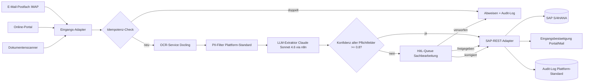

# Aurelia — Architektur-Blueprint UC-1

*Bezug: tickets.json (Epic `ep-1111-...`), Quelle BC2 konzept_id 8a3d2f1c-..., UC-1*

## Kontext

Aurelia Krankenkasse, Antragsbearbeitung Krankentagegeld (KP-07). UC-1 „Automatisierte Antragserfassung via OCR + LLM-Extraktion" ersetzt Schritt 1 „Antrag erfassen" (heute ~5 Min manuell durch Sachbearbeitung).

**AI-Act-Klasse:** high (siehe `compliance-audit.json`)
**Compliance-Stories:** 1 (Story-4 HitL-Pruefschritt)
**Speicherdauer:** 10 Jahre nach § 28f SGB IV (Plattform-Standard via Loeschungs-Cron)

## Datenfluss UC-1

## Komponenten (UC-spezifisch — als Stories abgebildet)

| Komponente | Rolle | Technologie | Story (kurz) |
|---|---|---|---|
| Eingangs-Adapter | drei Kanaele einlesen | n8n-Trigger (IMAP, HTTP, File-Watch) | Story 1 (`st-...-1`) |
| Idempotenz-Check | Duplikate abweisen | Postgres-Index auf Hash + Antragsnummer | Story 1 |
| OCR-Service | PDF zu strukturiertem Text | Docling | Story 2 (`st-...-2`) |
| LLM-Extraktor | Feld-Extraktion mit Konfidenz | Claude Sonnet 4.6 via Anthropic API ueber n8n | Story 2 |
| SAP-REST-Adapter | API-Schreiben ins SAP | SAP S/4HANA REST API ueber Service-User | Story 3 (`st-...-3`) |
| HitL-Queue | Sachbearbeiter-Interface | n8n + Web-UI | Story 4 (`st-...-4`, Compliance) |

## Plattform-Standards (NICHT als Stories — gelten fuer alle Use-Cases)

Diese Komponenten sind Pipeline-Infrastruktur und werden zentral betrieben:

| Komponente | Zweck | Erfuellt Pflicht (compliance-audit) |
|---|---|---|
| PII-Filter (Pre-LLM) | Pseudonymisierung vor Claude-Call | p2 [DSGVO Art. 25], p5 [DSGVO Art. 32] |
| Audit-Log (Append-only) | Verarbeitungs-Historie unveraenderbar | p3 [DSGVO Art. 30] |
| Loeschungs-Cron | Aufbewahrungsfrist durchsetzen | p4 [DSGVO Art. 17 + § 28f SGB IV] |
| TLS 1.3 + AES-256 | Verschluesselung in Transit + at Rest | p5 [DSGVO Art. 32] |

→ BC4 muss diese Standards einhalten, aber bekommt keine eigenen Tickets dafuer. Konfiguration liegt in der Plattform. ⚠ Owner-Team noch zu klaeren (siehe compliance-audit.json offene_fragen).

## Betroffene Externe Systeme

| System | Rolle | Integration |
|---|---|---|
| E-Mail-Server (IMAP) | Quelle | n8n IMAP-Trigger, Service-Account |
| Online-Portal | Quelle | REST-API mit OAuth2 |
| Dokumentenscanner | Quelle | Datei-Watch im SMB-Share |
| SAP S/4HANA | Ziel | REST-API mit Service-User, eigene Rolle |
| Anthropic API | Verarbeitung | n8n-Outbound, Vault-managed Key, nur pseudonymisierte Daten |

## Konfigurierbare Parameter

| Parameter | Default | Begruendung |
|---|---|---|
| Konfidenz-Threshold | 0.8 | BC2-Vorgabe in `fachliche_beschreibung` |
| HitL-Eskalations-Frist | 24 h | TBD im Compliance-Review |
| Loeschungs-Cron-Lauf | taeglich 02:00 | Plattform-Standard |
| Antragsvolumen-Annahme | ~300/Woche | BC2-Mock |

## Risiken (operativ)

| Risiko | W'lichkeit | Auswirkung | Massnahme |
|---|---|---|---|
| OCR-Qualitaet bei Handschrift unzureichend | mittel | mittel | HitL-Queue (Story 4) + Trainingsdaten je Antragsart |
| SAP-API-Zugang verzoegert sich | mittel | hoch | Mock-Adapter in S2-S3, produktive Anbindung erst S5 |
| LLM-Output strukturell inkonsistent | mittel | hoch | strukturierte Prompts mit Schema + Validierung |
| AI-Act-Konformitaetsbewertung verzoegert | hoch | hoch | parallele Vorbereitung mit DSB, Notar-Audit eingeplant |

## BC4-Hinweis (Worker-Routing aus Epic-`kategorien[]`)

Das Aurelia-Epic hat `kategorien: ["it:backend", "it:integration", "it:ai-pipeline"]`. Alle 4 Stories gehen an dieselben Worker — kein Story-spezifisches Routing.

Konsequenz fuer BC4: ein Mixed-Worker-Setup, das sowohl Backend (SAP-Adapter, Idempotenz-Check) als auch AI-Pipeline (OCR + LLM) als auch Integration (n8n-Trigger) bedient.

## Bezug zur BC3-Pipeline (v3.4)

Diese Architektur wurde durch die BC3-Pipeline erzeugt:
- Phase 2 (Compliance-Vorpruefung) → `compliance-audit.json` mit `ai_act_klasse=high` und Reservierung von Story-4-UUID fuer HitL
- Phase 4 (Slicer) → 3 UC-Stories aus `fachliche_anforderungen[]` + 1 Compliance-Story aus reservierter ID
- Phase 5 (Verifikation) → alle reservierten IDs sind als Stories vorhanden
- Phase 5b (Hochrisiko-Check) → DSB-Freigabe in compliance-audit.json noetig vor Output
- Phase 6 → 4 Dateien geschrieben

