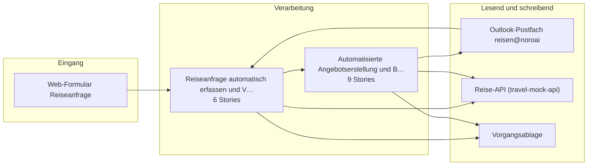

# Bauplan — uc1-reisebuchung

**Lieferung:** `del-uc1-reisebuchung-2026-09-06-070613`  
**Konzept:** `b1000000-0000-4000-8000-0000000000c1`  
**Erzeugt am:** 2026-09-06 durch den BC3-Slicer

> Automatisch erzeugt aus dem Ticket-Set. Nicht von Hand ändern —
> Änderungen gehen beim nächsten Lauf verloren.

## Überblick

## Komponenten

| Komponente | Rolle | Anbindung | Use Case |
|---|---|---|---|
| Web-Formular Reiseanfrage | Quelle | API | Reiseanfrage automatisch erfassen… |
| Outlook-Postfach reisen@noroai | Quelle, Quelle+Ziel | Email | Reiseanfrage automatisch erfassen…, Angebot erstellen und Buchung nac… |
| Reise-API (travel-mock-api) | Quelle+Ziel, Ziel | API | Reiseanfrage automatisch erfassen…, Angebot erstellen und Buchung nac… |
| Vorgangsablage | Ziel, Quelle+Ziel | DB | Reiseanfrage automatisch erfassen…, Angebot erstellen und Buchung nac… |

## Empfohlener Stack

- n8n
- Mistral Large
- PostgreSQL
- travel-mock-api

## Epics und Stories

### Reiseanfrage automatisch erfassen und Verfügbarkeit prüfen

`ep-7f86-9601-99bb-d235c7490f7d`  
**Ziel:** Automatisierte Erfassung und Verfügbarkeitsprüfung von Reiseanfragen innerhalb von zwei Minuten mit strukturierter Rückmeldung und Protokollierung.  
**Kategorien:** it:backend, it:integration

| Story | Titel | Akzeptanzkriterien |
|---|---|---|
| 1 | Anfragen aus Mail und Web-Formular einheitlich erfassen | 3 |
| 2 | Pflichtfelder extrahieren und Projekt/Kostenstelle zuordnen | 4 |
| 3 | Verfügbarkeitsprüfung in Reise-API durchführen | 3 |
| 4 | Eingangsbestätigung und Rückfragen automatisiert versenden | 2 |
| 5 | Vorgang mit Protokoll und Zeitstempeln in Ablage speichern | 2 |
| 6 | Transparenzhinweis in automatisierten E-Mails einbauen | 2 |

### Automatisierte Angebotserstellung und Buchungsauslösung nach Freigabe

`ep-9539-ba84-470c-dc60f3f7c980`  
**Ziel:** Automatisierte Erstellung, Versand und Verwaltung von Reiseangeboten mit anschließender Buchungsauslösung nach menschlicher Freigabe, inklusive Sonderfallbehandlung.  
**Kategorien:** it:backend, it:integration

| Story | Titel | Akzeptanzkriterien |
|---|---|---|
| 1 | Angebot aus geprüften Optionen generieren | 2 |
| 2 | Angebot mit Vorgangs-ID versenden und Antwort zuordnen | 2 |
| 3 | Erneute Prüfung bei abgelaufenen Optionen durchführen | 1 |
| 4 | Erinnerungen bei ausbleibender Zusage versenden und Vorgang… | 2 |
| 5 | Buchung nach Freigabe auslösen und Buchungsnummern speichern | 1 |
| 6 | Stornierung als Statuswechsel mit Protokolleintrag abbilden | 1 |
| 7 | Freigabeprozess für Reisebuchungen einbauen | 3 |
| 8 | Manuelle Übersteuerung der Reiseoptionen ermöglichen | 2 |
| 9 | Notfall-Anhaltefunktion für das KI-System einbauen | 2 |

---

2 Epics · 15 Stories · 4 Komponenten
