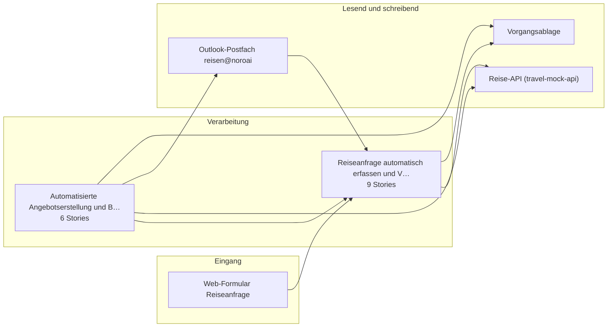

# Bauplan — uc1-reisebuchung

**Lieferung:** `del-uc1-reisebuchung-2026-09-03-192154`  
**Konzept:** `b1000000-0000-4000-8000-0000000000c1`  
**Erzeugt am:** 2026-09-03 durch den BC3-Slicer

> Automatisch erzeugt aus dem Ticket-Set. Nicht von Hand ändern —
> Änderungen gehen beim nächsten Lauf verloren.

## Überblick

## Komponenten

| Komponente | Rolle | Anbindung | Use Case |
|---|---|---|---|
| Web-Formular Reiseanfrage | Quelle | API | Reiseanfrage automatisch erfassen… |
| Vorgangsablage | Quelle+Ziel, Ziel | DB | Angebot erstellen und Buchung nac…, Reiseanfrage automatisch erfassen… |
| Outlook-Postfach reisen@noroai | Quelle+Ziel, Quelle | Email | Angebot erstellen und Buchung nac…, Reiseanfrage automatisch erfassen… |
| Reise-API (travel-mock-api) | Ziel, Quelle+Ziel | API | Angebot erstellen und Buchung nac…, Reiseanfrage automatisch erfassen… |

## Empfohlener Stack

- n8n
- Mistral Large
- PostgreSQL
- travel-mock-api

## Epics und Stories

### Automatisierte Angebotserstellung und Buchungsauslösung nach Freigabe

`ep-9539-ba84-470c-dc60f3f7c980`  
**Ziel:** Angebote aus geprüften Optionen automatisiert erstellen, Freigabe einholen und nach menschlicher Bestätigung Buchungen auslösen, inklusive Statusmanagement und Protokollierung.  
**Kategorien:** it:backend, it:integration

| Story | Titel | Akzeptanzkriterien |
|---|---|---|
| 1 | Angebot aus geprüften Optionen generieren | 2 |
| 2 | Angebot mit Vorgangs-ID versenden und Zuordnung sicherstell… | 2 |
| 3 | Zusage erfassen und Vorgang für Freigabe vorbereiten | 2 |
| 4 | Erinnerungen bei ausbleibender Zusage senden und Vorgang sc… | 2 |
| 5 | Buchung nach Freigabe auslösen und Buchungsnummern speichern | 2 |
| 6 | Transparenzhinweis in Angebots-E-Mails integrieren | 1 |

### Reiseanfrage automatisch erfassen und Verfügbarkeit prüfen

`ep-7f86-9601-99bb-d235c7490f7d`  
**Ziel:** Automatisierte Erfassung und Verfügbarkeitsprüfung von Reiseanfragen innerhalb von zwei Minuten mit strukturierter Rückmeldung und Protokollierung.  
**Kategorien:** it:backend, it:integration, it:ai-pipeline

| Story | Titel | Akzeptanzkriterien |
|---|---|---|
| 1 | Reiseanfragen aus Mail und Web-Formular einheitlich erfassen | 3 |
| 2 | Projekt- oder Kostenstellenzuordnung prüfen und sicherstell… | 2 |
| 3 | Verfügbarkeitsprüfung in Buchungsportalen durchführen | 2 |
| 4 | Budgetprüfung und Freigabeprozess umsetzen | 1 |
| 5 | Extraktionskonfidenz prüfen und manuelle Prüfung auslösen | 1 |
| 6 | Eingangsbestätigung und Rückfragen strukturiert versenden | 2 |
| 7 | Vorgangsprotokollierung mit Zeitstempeln und IDs umsetzen | 1 |
| 8 | Menschliche Freigabe vor Verfügbarkeitsprüfung und Angebots… | 2 |
| 9 | Auskunftsrecht für Beschäftigte umsetzen | 1 |

---

2 Epics · 15 Stories · 4 Komponenten
