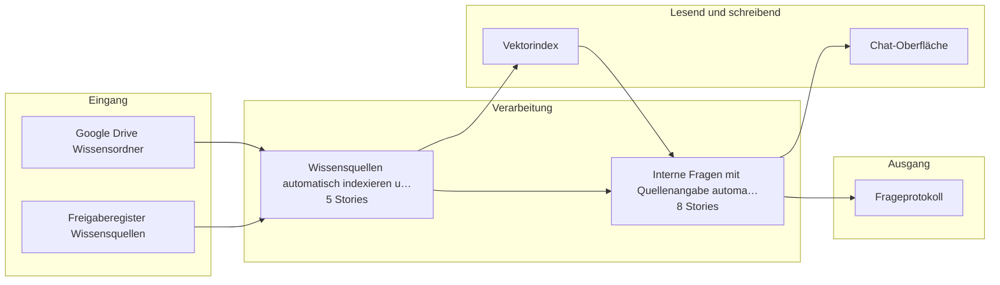

# Bauplan — uc2-wissensbasis

**Lieferung:** `del-uc2-wissensbasis-2026-09-06-073831`  
**Konzept:** `b2000000-0000-4000-8000-0000000000c2`  
**Erzeugt am:** 2026-09-06 durch den BC3-Slicer

> Automatisch erzeugt aus dem Ticket-Set. Nicht von Hand ändern —
> Änderungen gehen beim nächsten Lauf verloren.

## Überblick

## Komponenten

| Komponente | Rolle | Anbindung | Use Case |
|---|---|---|---|
| Google Drive Wissensordner | Quelle | API | Wissensquellen automatisch indexi… |
| Freigaberegister Wissensquellen | Quelle | DB | Wissensquellen automatisch indexi… |
| Vektorindex | Ziel, Quelle | DB | Wissensquellen automatisch indexi…, Interne Fragen mit Quellenangabe … |
| Chat-Oberfläche | Quelle+Ziel | API | Interne Fragen mit Quellenangabe … |
| Frageprotokoll | Ziel | DB | Interne Fragen mit Quellenangabe … |

## Empfohlener Stack

- n8n
- Mistral Large
- PostgreSQL
- Vektordatenbank

## Epics und Stories

### Wissensquellen automatisch indexieren und aktuell halten

`ep-1419-f870-10a8-6c3c69e6379c`  
**Ziel:** Einen durchsuchbaren Index aller freigegebenen Wissensquellen erstellen und bei Änderungen automatisch aktualisieren, um manuelle Suche zu ersetzen.  
**Kategorien:** it:backend, it:integration, it:ai-pipeline

| Story | Titel | Akzeptanzkriterien |
|---|---|---|
| 1 | Freigegebene Ordner identifizieren und überwachen | 3 |
| 2 | Dokumente aus freigegebenen Ordnern abrufen und verarbeiten | 4 |
| 3 | Index bei Änderungen aktualisieren | 3 |
| 4 | Fehlerliste für nicht verarbeitbare Dokumente pflegen | 2 |
| 5 | Metadaten für indexierte Abschnitte speichern | 2 |

### Interne Fragen mit Quellenangabe automatisiert beantworten

`ep-9f05-a08d-e2b8-c7d19d3681b9`  
**Ziel:** Automatisiertes Auffinden und Formulieren von belegten Antworten auf interne Fragen mit Quellenangabe, um Recherchezeit zu reduzieren und Wissen nachvollziehbar zu machen.  
**Kategorien:** it:backend, it:integration, it:ai-pipeline

| Story | Titel | Akzeptanzkriterien |
|---|---|---|
| 1 | Frage entgegennehmen und auf Mandantenbezug prüfen | 3 |
| 2 | Frage im Vektorindex suchen und relevante Quellen identifiz… | 3 |
| 3 | Antwort mit Quellenangabe je Aussage formulieren | 3 |
| 4 | Antwort ohne ausreichende Quellen ablehnen | 2 |
| 5 | Frage, Antwort und Quellen protokollieren | 3 |
| 6 | Antwort an den Fragenden zurückgeben | 3 |
| 7 | Transparenzhinweis in Antwort integrieren | 1 |
| 8 | E-Mail-Adresse vor Protokollierung pseudonymisieren | 1 |

---

2 Epics · 13 Stories · 5 Komponenten
