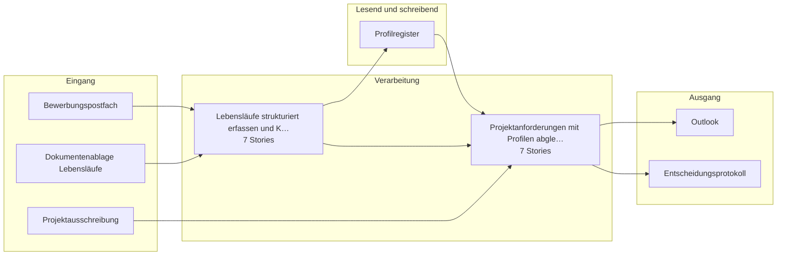

# Bauplan — uc3-consultant-placement

**Lieferung:** `del-uc3-consultant-placement-2026-09-06-074930`  
**Konzept:** `b3000000-0000-4000-8000-0000000000c3`  
**Erzeugt am:** 2026-09-06 durch den BC3-Slicer

> Automatisch erzeugt aus dem Ticket-Set. Nicht von Hand ändern —
> Änderungen gehen beim nächsten Lauf verloren.

## Überblick

## Komponenten

| Komponente | Rolle | Anbindung | Use Case |
|---|---|---|---|
| Bewerbungspostfach | Quelle | Email | Lebensläufe strukturiert erfassen… |
| Dokumentenablage Lebensläufe | Quelle | Datei | Lebensläufe strukturiert erfassen… |
| Projektausschreibung | Quelle | Datei | Projektanforderung mit Profilen a… |
| Profilregister | Ziel, Quelle | DB | Lebensläufe strukturiert erfassen…, Projektanforderung mit Profilen a… |
| Outlook | Ziel | Email | Projektanforderung mit Profilen a… |
| Entscheidungsprotokoll | Ziel | DB | Projektanforderung mit Profilen a… |

## Empfohlener Stack

- n8n
- Mistral Large
- PostgreSQL
- OCR-Service

## Epics und Stories

### Lebensläufe strukturiert erfassen und Kompetenzprofil aufbauen

`ep-1732-a36b-78d2-83970c030237`  
**Ziel:** Automatisierte Extraktion und strukturierte Speicherung von Lebenslaufdaten in ein einheitliches Kompetenzprofil mit Belegstellen und Markierung unsicherer Angaben.  
**Kategorien:** it:backend, it:integration, it:ai-pipeline

| Story | Titel | Akzeptanzkriterien |
|---|---|---|
| 1 | Lebenslauf-Dateien aus Postfach abrufen und Einwilligung pr… | 3 |
| 2 | Lebenslauf-Inhalte extrahieren und strukturieren | 4 |
| 3 | Strukturiertes Kompetenzprofil im Register speichern | 2 |
| 4 | Profil für betroffene Person zur Einsicht und Korrektur ber… | 2 |
| 5 | Profile nach Ablauf der Aufbewahrungsfrist löschen | 1 |
| 6 | Transparenzhinweis bei Einwilligungserfassung integrieren | 2 |
| 7 | Protokollierung der Extraktion und des Abgleichs implementi… | 2 |

### Projektanforderungen mit Profilen abgleichen und Vorschlagsliste automatisiert erzeugen

`ep-6880-f9da-611f-5bee0478c626`  
**Ziel:** Automatisiertes Auffinden und Vorsortieren passender Profile für Projektausschreibungen binnen Minuten, um die manuelle Sichtung zu ersetzen und eine begründete Vorschlagsliste zu liefern.  
**Kategorien:** it:backend, it:integration, it:ai-pipeline

| Story | Titel | Akzeptanzkriterien |
|---|---|---|
| 1 | Anforderungen aus Projektausschreibung strukturiert erfassen | 2 |
| 2 | Profile mit Anforderungen abgleichen und Matching-Ergebnis … | 3 |
| 3 | Vorschlagsliste mit Begründung und Profilfeld-Verweisen ers… | 2 |
| 4 | Technische Sperre für Ablehnungen ohne menschliche Entschei… | 2 |
| 5 | Transparenzhinweis für Betroffene bereitstellen | 1 |
| 6 | Vorschlagsliste an Outlook für Versand vorbereiten | 1 |
| 7 | Menschliche Entscheidung vor Versand der Vorschlagsliste er… | 2 |

---

2 Epics · 14 Stories · 6 Komponenten
